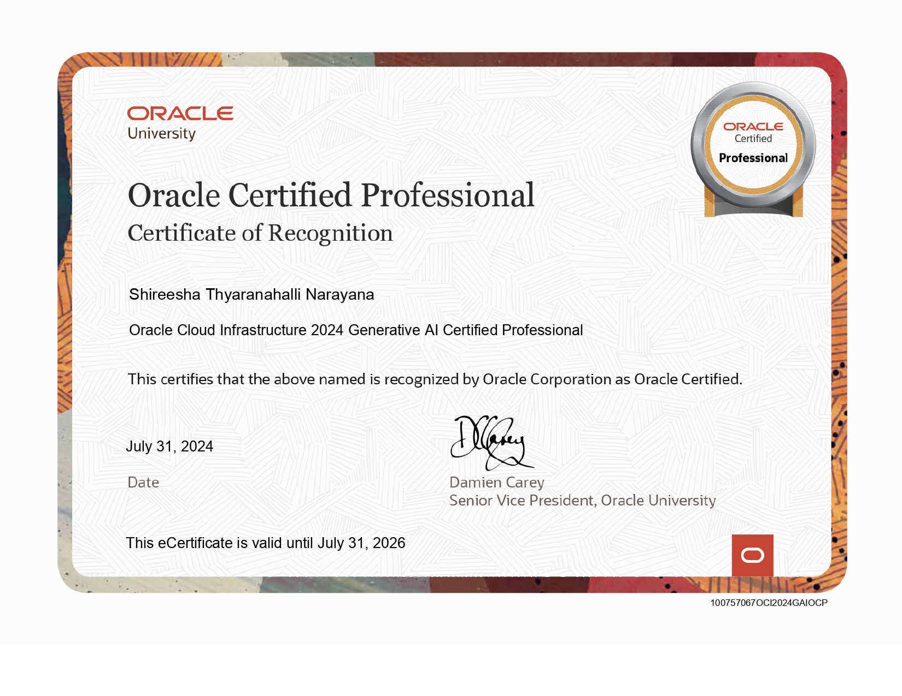
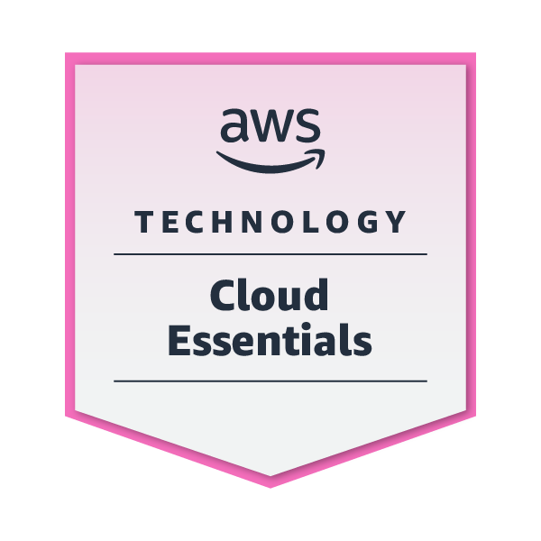

<h1 align="center">Hi 👋, I'm Shireesha TN</h1>
<h3 align="center">A passionate Data Engineer | Data Analyst | Machine Learning Engineer from Canada</h3>

  

#### Here are a few things you should know about me:

- 🌱 I’m currently learning **[Gen AI]()**.
- 👯 I’m looking to collaborate with other Developers.
- 🥅 Goals: Contribute more to Open Source projects.
- ⚡ Fun fact: I'm a problem-solver and car enthusiast.

### My passions are:

- 💻 Data Scientist, AI/ML, Big Data Architecture.
- 🛠️ Building software from zero to one.
- 🐍 Python/Shell.
- 🚀 Initiate project and launch software.

<h3 align="left">Connect with me:</h3>

<h3 align="left">Languages and Tools:</h3>

                        

# 🏅 Certificates :

<h3 align="left">📊 GitHub Stats:</h3>

